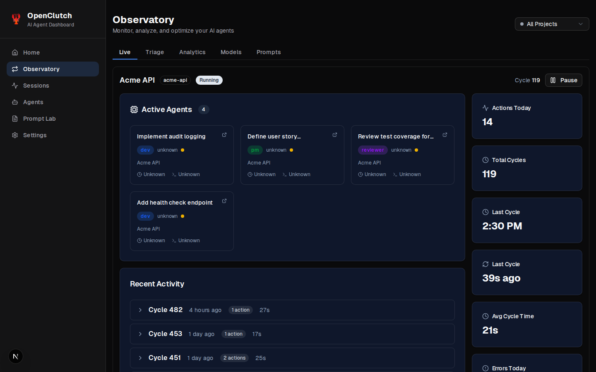
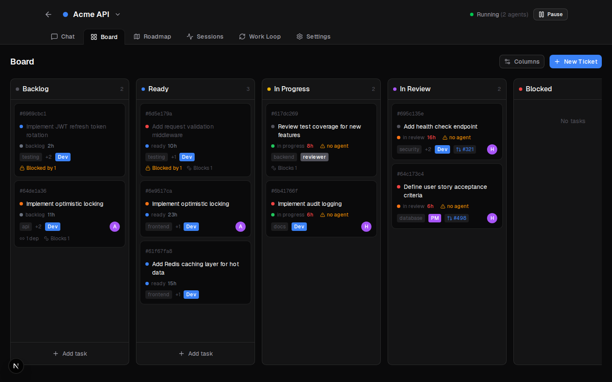
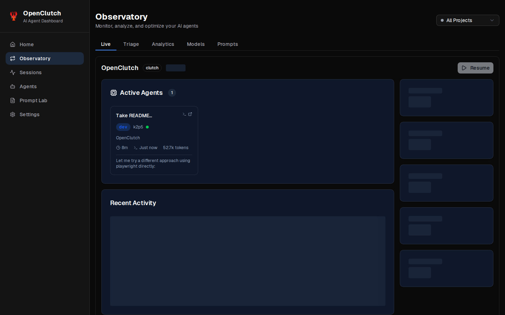
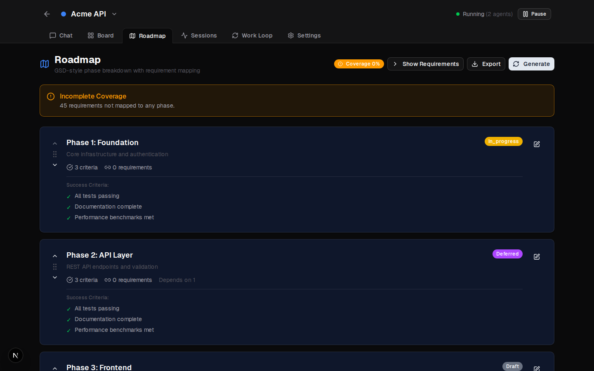
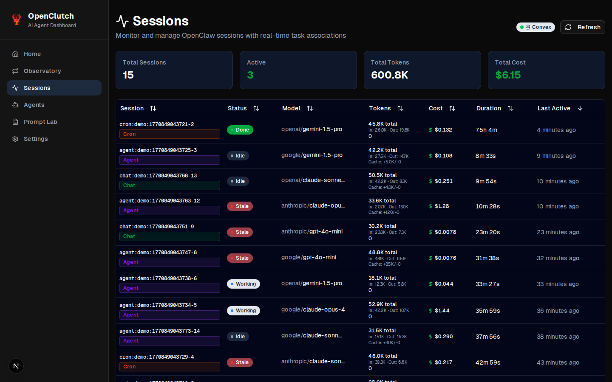
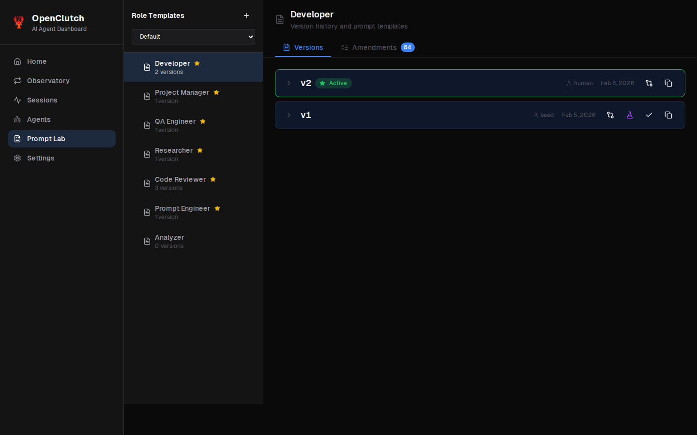

# OpenClutch

> AI agent orchestration platform. Coordinate specialized sub-agents to build software autonomously.

[](https://github.com/Codesushi-com/clutch/actions/workflows/ci.yml)
[](https://github.com/Codesushi-com/clutch/actions/workflows/deploy-site.yml)



OpenClutch is an autonomous software development platform that orchestrates AI agents to plan, code, review, and deploy changes. It replaces manual project management with an intelligent work loop that continuously assigns tasks to specialized agents, monitors progress, and ensures quality through automated reviews.

## Features

- **Agent Orchestration** — Coordinate multiple AI agents across projects with configurable roles (dev, reviewer, pm, research, conflict_resolver)
- **Work Loop Engine** — Continuous task scheduling with automatic triage, work assignment, and review pipelines
- **Observatory Dashboard** — Real-time monitoring with 5 tabs: Live, Triage, Analytics, Models, and Prompts
- **Real-time Backend** — Convex-powered reactive data layer for instant UI updates
- **Bidirectional Chat** — WebSocket integration with OpenClaw for seamless agent communication
- **GitHub Integration** — Automated PR creation, review, and merge workflows
- **CLI Tool** — Command-line interface for task management and deployment
- **Multi-Project Support** — Manage multiple repositories with isolated worktrees

## Screenshots

<details>
<summary><b>🏠 Observatory Dashboard</b> — Real-time work-loop monitoring with live stats, active agents, and activity logs</summary>


</details>

<details>
<summary><b>📋 Kanban Board</b> — Drag-and-drop task management across all statuses</summary>



</details>

<details>
<summary><b>💬 Agent Chat</b> — Bidirectional conversations with AI agents</summary>


</details>

<details>
<summary><b>🔄 Work Loop</b> — Live analytics and monitoring</summary>



</details>

<details>
<summary><b>🗺️ Roadmap</b> — Project phases and requirements tracking</summary>



</details>

<details>
<summary><b>📊 Sessions</b> — Token usage and cost tracking</summary>



</details>

<details>
<summary><b>🧪 Prompt Lab</b> — Prompt versions and performance metrics</summary>



</details>

## Architecture

```
┌─────────────────────────────────────────────────────────────────────────┐
│                           OpenClutch Platform                            │
├─────────────────────────────────────────────────────────────────────────┤
│                                                                          │
│  ┌──────────────┐  ┌──────────────┐  ┌──────────────┐  ┌──────────────┐ │
│  │ clutch-server│  │ clutch-loop  │  │clutch-bridge │  │clutch-session│ │
│  │   (Next.js)  │  │  (Worker)    │  │   (Worker)   │  │  -watcher    │ │
│  │   Port 3002  │  │Orchestration │  │ OpenClaw WS  │  │ JSONL Reader │ │
│  └──────┬───────┘  └──────┬───────┘  └──────┬───────┘  └──────┬───────┘ │
│         │                 │                 │                 │         │
│         └─────────────────┴─────────────────┴─────────────────┘         │
│                                    │                                    │
│                                    ▼                                    │
│  ┌─────────────────────────────────────────────────────────────────┐   │
│  │                    Convex (Self-Hosted)                          │   │
│  │  • tasks • projects • sessions • workLoopState • signals        │   │
│  └─────────────────────────────────────────────────────────────────┘   │
│                                    │                                    │
│                                    ▼                                    │
│  ┌─────────────────────────────────────────────────────────────────┐   │
│  │                      OpenClaw Gateway                            │   │
│  │            (AI Agent Runtime - Separate Service)                 │   │
│  └─────────────────────────────────────────────────────────────────┘   │
│                                                                          │
└─────────────────────────────────────────────────────────────────────────┘
```

### Systemd Setup

The systemd service files use templates with placeholders. Before installing:

```bash
# Generate service files with your paths
cd systemd
./setup.sh

# Or with custom paths:
INSTALL_DIR=/path/to/clutch NODE_PATH=/path/to/node ./setup.sh
```

This creates `.service` files from the templates. Then install them:

```bash
# Copy to systemd user directory
cp *.service ~/.config/systemd/user/

# Reload and enable
systemctl --user daemon-reload
systemctl --user enable clutch-server clutch-loop clutch-bridge clutch-session-watcher
systemctl --user start clutch-server clutch-loop clutch-bridge clutch-session-watcher
```

### Process Overview

| Process | Purpose | Description |
|---------|---------|-------------|
| `clutch-server` | Web UI & API | Next.js application serving the dashboard and REST endpoints |
| `clutch-loop` | Orchestration | Work loop engine that schedules and monitors agents |
| `clutch-bridge` | WebSocket Client | Bidirectional chat sync between OpenClutch and OpenClaw |
| `clutch-session-watcher` | File Monitor | Reads OpenClaw JSONL session files and upserts to Convex |

### Data Flow

1. **Task Creation** → Stored in Convex `tasks` table
2. **Work Loop** → Detects ready tasks, spawns agents via OpenClaw
3. **Agent Execution** → OpenClaw runs agents, writes to JSONL files
4. **Session Watcher** → Reads JSONL, upserts to Convex `sessions`
5. **UI Update** → Convex subscriptions push updates to Observatory dashboard

## Quick Start

### Prerequisites

- **Node.js 22** (via [Volta](https://volta.sh) recommended: `volta install node@22`)
- **pnpm 10+** (`npm install -g pnpm`)
- **Convex** (self-hosted via Docker, or use Convex Cloud)
- **OpenClaw** gateway (separate service - see [OpenClaw](https://github.com/openclaw/openclaw))

### Installation

```bash
# Clone the repository
git clone https://github.com/OWNER/REPO.git
cd REPO

# Install dependencies
pnpm install

# Set up environment
cp .env.example .env.local
# Edit .env.local with your configuration (see Configuration section)

# Deploy Convex schema
npx convex deploy

# Start development server
pnpm dev
```

The dev server will be available at `http://localhost:3002`.

**Note:** Role prompts are automatically seeded on first work loop startup. If you need to manually seed prompts (e.g., for a fresh database), run `pnpm seed:prompts`.

### Running the Full Stack

For production deployment with all four processes:

```bash
# Build and start all systemd services
./run.sh start

# Check status
./run.sh status

# View logs
./run.sh logs          # Server logs
./run.sh loop-logs     # Work loop logs
./run.sh all-logs      # All processes
```

### Demo Environment

For screenshots, demos, and onboarding without affecting production data:

```bash
# Quick start: start, deploy, seed, and run
pnpm demo:up && pnpm demo:deploy && pnpm demo:seed && pnpm demo:dev

# Or step by step:
pnpm demo:up        # Start demo Convex on ports 3230/6811
pnpm demo:deploy    # Deploy schema
pnpm demo:seed      # Seed with realistic demo data
pnpm demo:dev       # Start dev server with demo config
```

The demo environment includes:
- 4 sample projects with realistic data
- 40-50 tasks across all statuses
- Chat threads, work loop history, sessions
- Roadmap with phases and features
- Fully functional UI without touching production

See [docs/demo-environment.md](./docs/demo-environment.md) for complete documentation.

## Configuration

Create `.env.local` from the example below:

```bash
# OpenClaw API (server-side)
OPENCLAW_HTTP_URL=http://localhost:18789
OPENCLAW_WS_URL=ws://localhost:18789/ws
OPENCLAW_TOKEN=<your-gateway-token>
OPENCLAW_HOOKS_URL=http://localhost:18789/hooks
OPENCLAW_HOOKS_TOKEN=<your-hooks-token>

# OpenClaw (client-side)
# Use localhost for local dev, or your server IP/domain for network access
NEXT_PUBLIC_OPENCLAW_API_URL=http://localhost:18789
NEXT_PUBLIC_OPENCLAW_WS_URL=ws://localhost:18789/ws
NEXT_PUBLIC_OPENCLAW_TOKEN=<your-gateway-token>

# Convex
CONVEX_SELF_HOSTED_URL=http://localhost:3210
CONVEX_SELF_HOSTED_ADMIN_KEY=<admin-key>
CONVEX_URL=http://localhost:3210
NEXT_PUBLIC_CONVEX_SITE_URL=http://localhost:3211

# Work Loop
WORK_LOOP_ENABLED=true
WORK_LOOP_MAX_AGENTS=4
WORK_LOOP_MAX_AGENTS_PER_PROJECT=3
WORK_LOOP_MAX_DEV_AGENTS=2
WORK_LOOP_MAX_REVIEWER_AGENTS=2

# Server
PORT=3002

# Optional: Additional dev origins for Next.js dev server (comma-separated hostnames)
# NEXT_PUBLIC_DEV_ORIGINS=192.168.1.100,mydomain.com

# Optional: GitHub repository URL for the settings page
# NEXT_PUBLIC_GITHUB_URL=https://github.com/yourusername/clutch
```

### OpenClaw Connection

OpenClutch requires a running OpenClaw gateway for agent execution:

1. Install and configure [OpenClaw](https://github.com/openclaw/openclaw)
2. Copy the gateway token from `~/.openclaw/openclaw.json`
3. Set `OPENCLAW_TOKEN` and `NEXT_PUBLIC_OPENCLAW_TOKEN` in `.env.local`

### Convex Setup

**Self-hosted (Docker):**

```bash
# Start Convex
docker run -d --name convex-local -p 3210:3210 -p 3211:3211 \
  -v convex-data:/data ghcr.io/get-convex/convex-local:latest

# Deploy schema
npx convex deploy --url http://localhost:3210 --admin-key <admin-key>
```

**Note:** Role prompts are stored externally (configure via `ROLES_DIR` env var, defaults to `../clawd/roles/` relative to this repo):
- `dev.md` - Developer agent prompt
- `reviewer.md` - Reviewer agent prompt
- `pm.md` - Product manager prompt
- `research.md` - Researcher prompt
- `conflict_resolver.md` - Conflict resolver prompt
- `qa.md` - QA agent prompt
- `pe.md` - Prompt engineer prompt

Set `CONVEX_URL` to your deployment URL and remove self-hosted variables.

## Work Loop

The work loop is OpenClutch's core orchestration engine. It continuously cycles through phases to manage agent execution.

### Phases

```
┌─────────┐    ┌─────────┐    ┌─────────┐    ┌─────────┐
│ Cleanup │───→│ Triage  │───→│ Review  │───→│  Work   │──┐
└─────────┘    └─────────┘    └─────────┘    └─────────┘  │
                                                  │        │
                                                  └────────┘
```

1. **Cleanup** — Close stale browser tabs, reset transient state
2. **Triage** — Identify blocked tasks and notify for human review
3. **Review** — Check completed work, spawn reviewers for PRs
4. **Work** — Spawn agents for ready tasks

### Agent Roles

| Role | Model | Purpose |
|------|-------|---------|
| `dev` | kimi-for-coding | Implement features, fix bugs |
| `reviewer` | kimi-for-coding | Review PRs, request changes or merge |
| `pm` | sonnet | Research, plan, write specs |
| `research` | sonnet | Deep investigation, analysis |
| `conflict_resolver` | kimi-for-coding | Auto-rebase and resolve merge conflicts |

### Task Status Flow

```
backlog → ready → in_progress → in_review → done
              ↓        ↓
           blocked ←─┘
```

- **backlog** — Holding pen for future work
- **ready** — Available for agents to pick up
- **in_progress** — Agent actively working
- **in_review** — PR opened, waiting for review
- **blocked** — Stuck, needs triage
- **done** — Completed

### Concurrency Configuration

Match OpenClutch's agent limits with OpenClaw's command lane concurrency:

**OpenClaw config (`~/.openclaw/openclaw.json`):**
```json
{
  "agents": {
    "defaults": {
      "maxConcurrent": 8
    }
  }
}
```

If OpenClaw's limit is lower than OpenClutch's, agents will queue and may timeout.

## Observatory

The Observatory is the centralized dashboard for monitoring and controlling AI agents.

### Routes

- **Global:** `/work-loop` — All projects
- **Per-Project:** `/projects/[slug]/work-loop` — Single project view

### Tabs

| Tab | Purpose |
|-----|---------|
| **Live** | Real-time work-loop monitoring, active agents, statistics |
| **Triage** | Blocked task management and unblocking |
| **Analytics** | Historical performance, cost tracking, metrics |
| **Models** | Model usage comparison and cost analysis |
| **Prompts** | Prompt performance analysis and A/B testing |

## CLI

The `clutch` CLI provides command-line access to tasks, agents, and deployment.

```bash
# Tasks
clutch tasks list --project clutch --status ready
clutch tasks get <task-id>
clutch tasks move <task-id> in_review

# Agents
clutch agents list
clutch agents get <agent-id>

# Signals
clutch signals list --pending
clutch signals respond <signal-id> "Answer"

# Deploy
clutch deploy convex --project clutch
```

**Projects:** `clutch` (default), add your own via the UI  
**Statuses:** `backlog` → `ready` → `in_progress` → `in_review` → `done`  
**Priorities:** `low`, `medium`, `high`, `urgent`  
**Roles:** `pm`, `dev`, `research`, `reviewer`, `conflict_resolver`

## Landing Page Deployment (clutch.md)

The clutch.md landing page is a static site deployed to AWS S3 + CloudFront.

### Prerequisites

- AWS CLI with `personal` profile configured
- OpenTofu (or Terraform) installed
- Access to the `dbachelder/infra` repo (for the static-site module)

### Infrastructure Setup

The infrastructure is defined in the `infra/` directory using OpenTofu:

```bash
cd infra/

# Initialize OpenTofu (downloads providers and modules)
tofu init

# Plan the deployment
tofu plan

# Apply the infrastructure
tofu apply
```

This creates:
- S3 bucket for static hosting (`clutch.md`)
- CloudFront distribution with HTTPS
- ACM certificate (us-east-1)
- Route 53 DNS records (apex + www)

### Deploy the Site

```bash
# Deploy to production
./deploy.sh prod

# Or just
./deploy.sh
```

The deploy script:
1. Runs `pnpm build` to generate static output
2. Syncs `out/` directory to S3 with `--delete`
3. Creates CloudFront invalidation for `/*`

### Infrastructure Outputs

After applying, get the outputs with:

```bash
cd infra/
tofu output
```

Key outputs:
- `bucket_name` — S3 bucket for manual uploads
- `cloudfront_distribution_id` — For cache invalidation
- `website_url` — https://clutch.md

---

## Deployment

### Systemd Setup

The `run.sh` script installs and manages systemd user services:

```bash
# Install services
./run.sh install

# Enable and start
./run.sh start

# Check status
./run.sh status
```

Service files are in `systemd/`:
- `clutch-server.service` — Next.js server
- `clutch-loop.service` — Work loop worker
- `clutch-bridge.service` — Chat bridge worker
- `clutch-session-watcher.service` — Session file watcher

### Nginx Reverse Proxy

For HTTPS deployment with WebSocket support:

```nginx
server {
    listen 443 ssl;
    server_name your-domain.com;

    location / {
        proxy_pass http://localhost:3002;
        proxy_http_version 1.1;
        proxy_set_header Host $host;
        proxy_set_header X-Real-IP $remote_addr;
    }

    # WebSocket proxy for OpenClaw
    location = /openclaw-ws {
        proxy_pass http://localhost:18789/ws;
        proxy_http_version 1.1;
        proxy_set_header Upgrade $http_upgrade;
        proxy_set_header Connection "upgrade";
        proxy_read_timeout 86400;
        proxy_buffering off;
    }
}
```

## Development

### Dev Server

```bash
# Start dev server (port 3002)
pnpm dev
```

Uses Turbopack for fast hot-reload. Do not start multiple dev servers.

### Testing

```bash
# Run tests
pnpm test

# Run tests with UI
pnpm test:ui

# Type check
pnpm typecheck

# Lint
pnpm lint
```

### Git Worktrees

**Never switch branches in your main repo directory** - the dev server runs there on `main`.

For feature work:

```bash
cd /path/to/clutch
git worktree add /path/to/clutch-worktrees/fix/<ticket-id> -b fix/<ticket-id>
cd /path/to/clutch-worktrees/fix/<ticket-id>
# ... work ...
```

### Pre-commit Hooks

Pre-commit hooks run lint and typecheck. Never use `--no-verify` — fix any failures before committing.

```bash
# If hooks fail
pnpm lint
pnpm typecheck
# Fix errors, then commit
```

## Project Structure

```
clutch/
├── app/                    # Next.js app router
│   ├── api/                # REST API routes
│   ├── projects/[slug]/    # Project pages
│   └── work-loop/          # Observatory dashboard
├── components/             # React components
│   ├── observatory/        # Dashboard tabs
│   ├── board/              # Kanban board
│   └── chat/               # Chat UI
├── lib/                    # Library code
│   ├── convex/             # Convex queries/mutations
│   └── hooks/              # React hooks
├── worker/                 # Background workers
│   ├── loop.ts             # Work loop engine
│   ├── agent-manager.ts    # Agent lifecycle
│   ├── chat-bridge.ts      # WebSocket bridge
│   └── phases/             # Loop phases
├── convex/                 # Database schema and functions
├── plugins/                # OpenClaw plugins
├── bin/                    # CLI source
├── systemd/                # Systemd service files
└── run.sh                  # Process management
```

## Contributing

Contributions are welcome! Please see [CONTRIBUTING.md](./CONTRIBUTING.md) for guidelines.

## License

MIT License — see [LICENSE](./LICENSE) for details.
